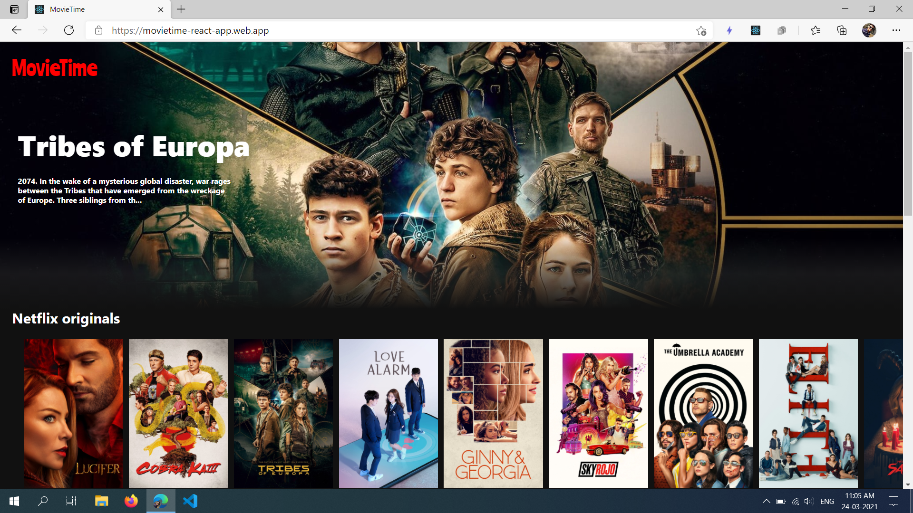
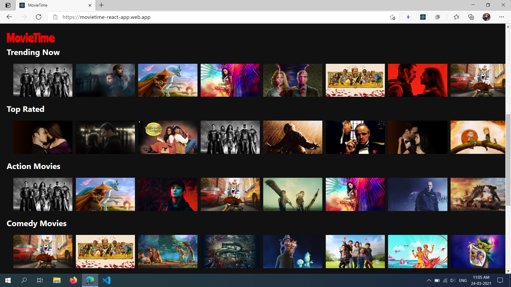

# Movie Time React-App

It is a React-App to watch trailers of Movies.

* I have used __TMDB(The Movie Database)__ API to fetch details of movies.
* And I have used the __react-youtube module__ to fetch trailers of movies.
* The web-app is deployed on firebase

Link: https://movietime-react-app.web.app/

Screenshots:

